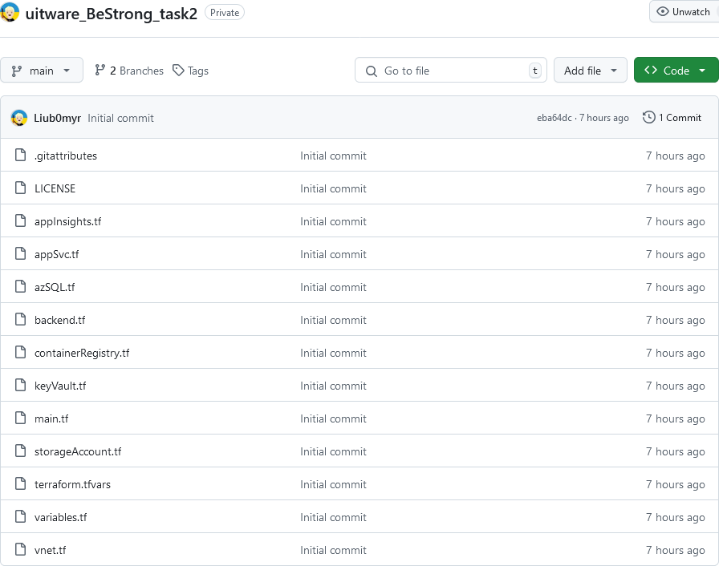
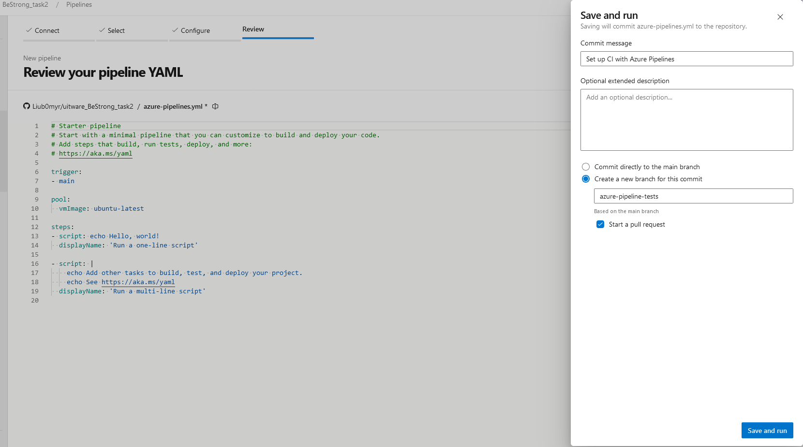
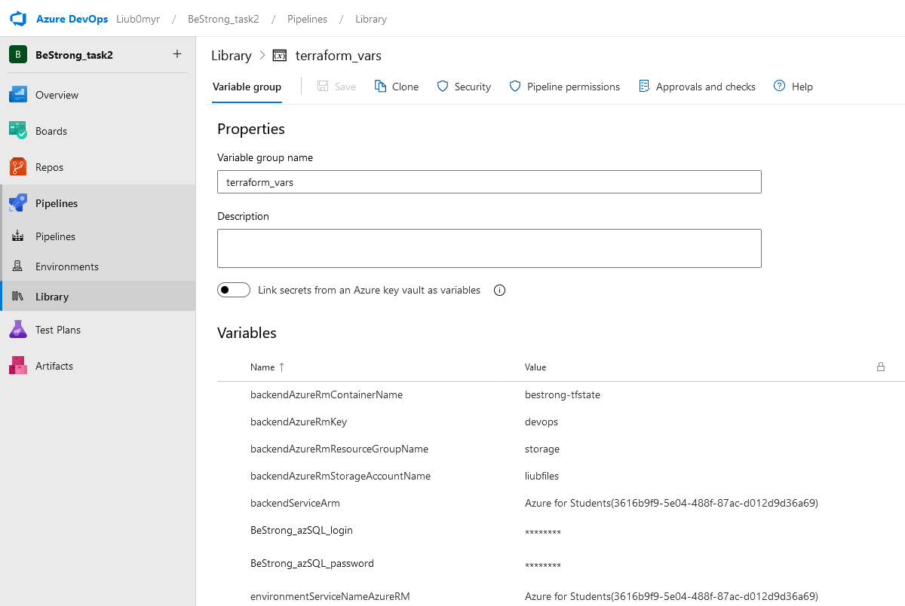
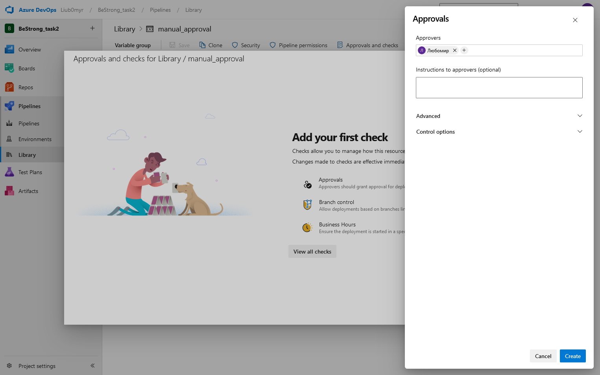
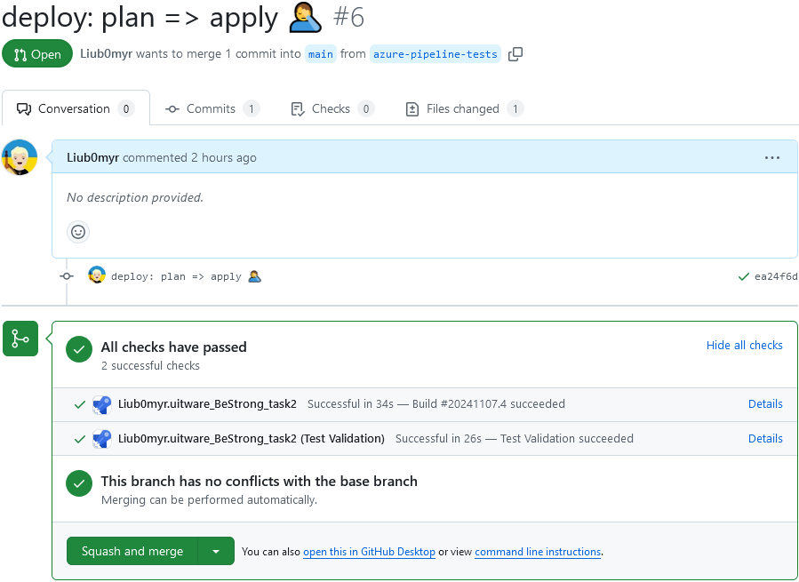
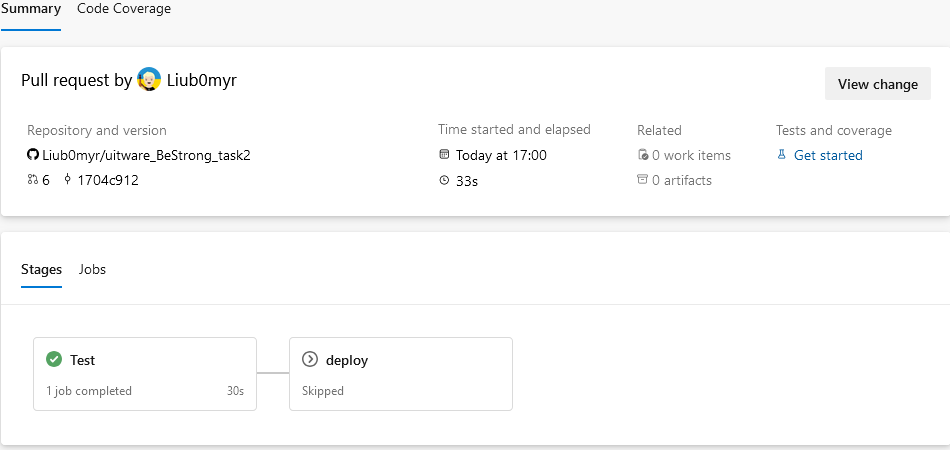
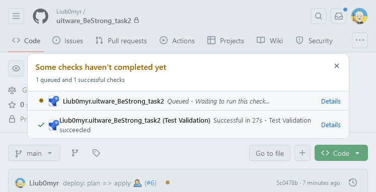
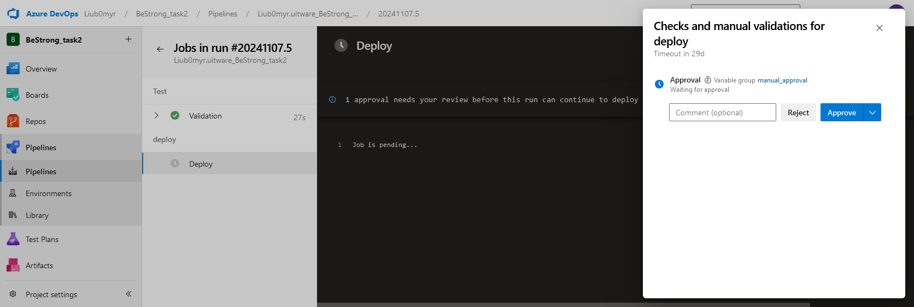
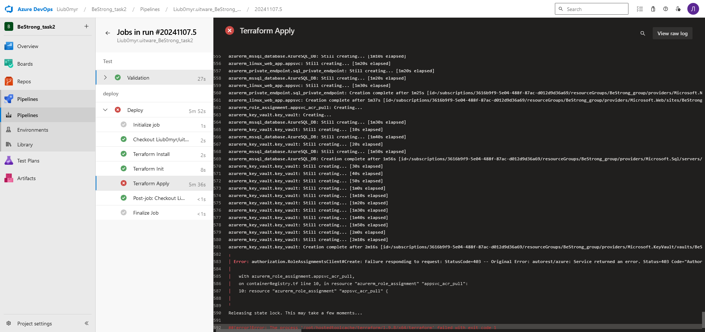

# [BeStrong task 2](https://github.com/Liub0myr/uitware_BeStrong_task2/)

Before starting, I copied the files from the first task to [a new repository](https://github.com/Liub0myr/uitware_BeStrong_task2/) to avoid conflicts with GitHub Actions.



Next, using the Azure DevOps portal, a starter pipeline was created in a new branch *azure-pipeline-tests*.



The variable group *terraform_vars* was created for the variables in the Library



To add manual approval for applying changes, I used a trick with variable group by creating a dummy *manual_approval* that does not change anything, but when used requires manual approval



The following yaml is used for CI/CD

```yml
# https://aka.ms/yaml

trigger:
- main

pr:
- main

variables:
  - group: terraform_vars

stages:
- stage: Test
  jobs:
  - job: validate
    displayName: 'Validation'
    steps:
    - task: TerraformInstaller@1
      inputs:
        terraformVersion: 'latest'
      displayName: 'Terraform Install'
    - task: TerraformTaskV4@4
      inputs:
        provider: 'azurerm'
        command: 'init'
        backendServiceArm: $(backendServiceArm)
        backendAzureRmResourceGroupName: $(backendAzureRmResourceGroupName)
        backendAzureRmStorageAccountName: $(backendAzureRmStorageAccountName)
        backendAzureRmContainerName: $(backendAzureRmContainerName)
        backendAzureRmKey: '$(backendAzureRmKey).tfstate'
      displayName: 'Terraform Init'
    - task: TerraformTaskV4@4
      displayName: 'Validate'
      inputs:
        provider: 'azurerm'
        command: 'validate'
    - task: TerraformTaskV4@4
      displayName: 'Terraform plan'
      inputs:
        provider: 'azurerm'
        command: 'plan'
        environmentServiceNameAzureRM: $(environmentServiceNameAzureRM)
        commandOptions: '-input=false'
      env:
          TF_VAR_BeStrong_azSQL_login: $(BeStrong_azSQL_login)
          TF_VAR_BeStrong_azSQL_password: $(BeStrong_azSQL_password)

- stage: deploy
  condition: ne(variables['Build.Reason'], 'PullRequest') # Skip for PR
  jobs:
  - job: deploy
    displayName: 'Deploy'
    variables:
    - group: manual_approval # # required for manual approval. DO NOT REMOVE!
    steps:
    - task: TerraformInstaller@1
      inputs:
        terraformVersion: 'latest'
      displayName: 'Terraform Install'
    - task: TerraformTaskV4@4
      inputs:
        provider: 'azurerm'
        command: 'init'
        backendServiceArm: $(backendServiceArm)
        backendAzureRmResourceGroupName: $(backendAzureRmResourceGroupName)
        backendAzureRmStorageAccountName: $(backendAzureRmStorageAccountName)
        backendAzureRmContainerName: $(backendAzureRmContainerName)
        backendAzureRmKey: '$(backendAzureRmKey).tfstate'
      displayName: 'Terraform Init'
    - task: TerraformTaskV4@4
      displayName: 'Terraform Apply'
      inputs:
        provider: 'azurerm'
        command: 'apply'
        environmentServiceNameAzureRM: $(environmentServiceNameAzureRM)
        commandOptions: '-input=false -auto-approve'
      env:
          TF_VAR_BeStrong_azSQL_login: $(BeStrong_azSQL_login)
          TF_VAR_BeStrong_azSQL_password: $(BeStrong_azSQL_password)
```

After creating the pull request, Azure pipeline automatically started the verification process



As you can see, the Deploy stage was automatically skipped



After the merge, Pipeline started up again, but got stuck on Test Validation



However, as you can see, Azure is waiting for my approval



As you can see, a 403 error occurred. It occurs because Azure assigns the Contributor role to terraform by default, which does not have the right to issue permissions.

