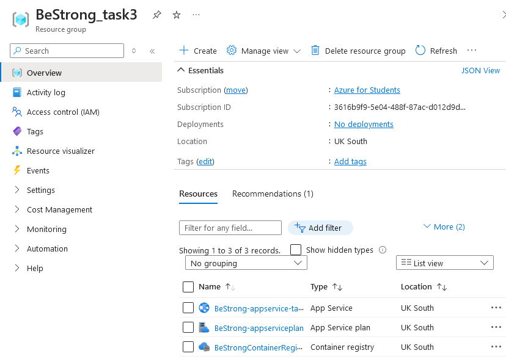
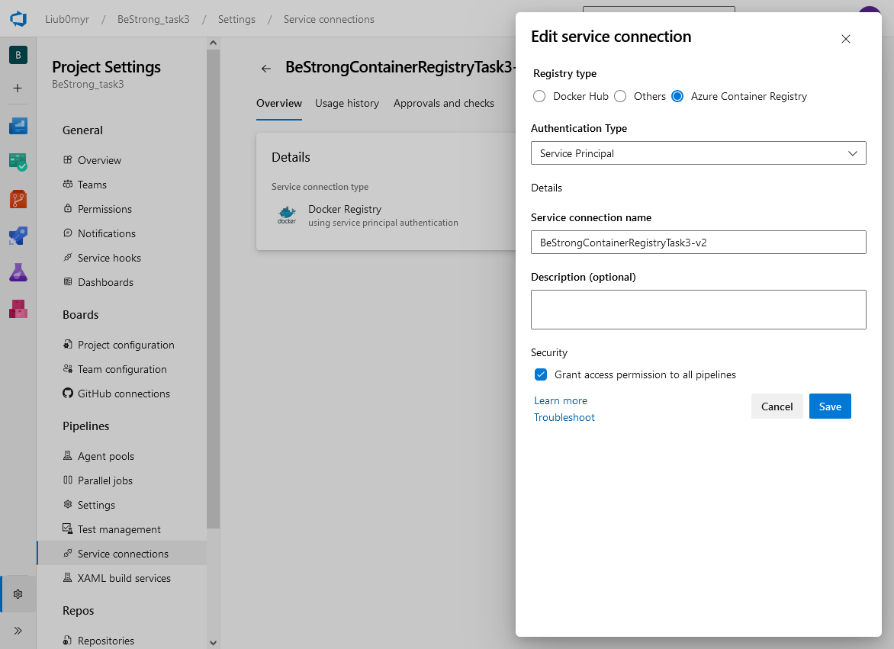
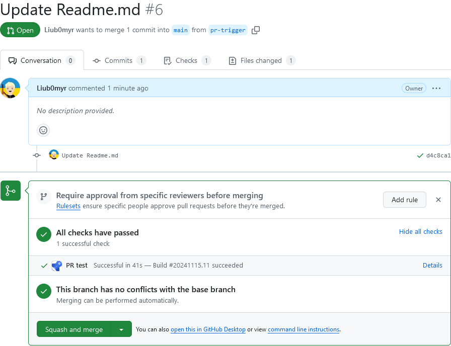
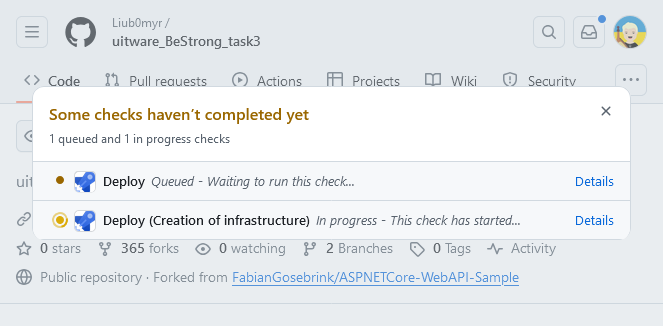
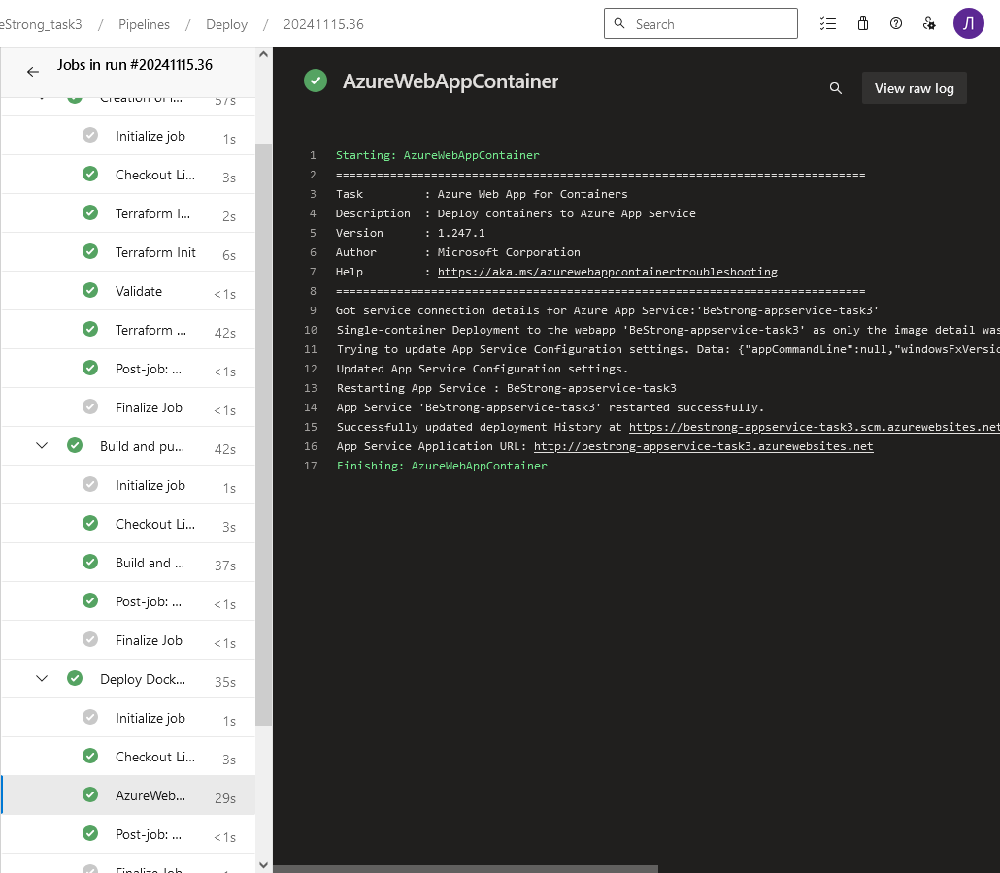
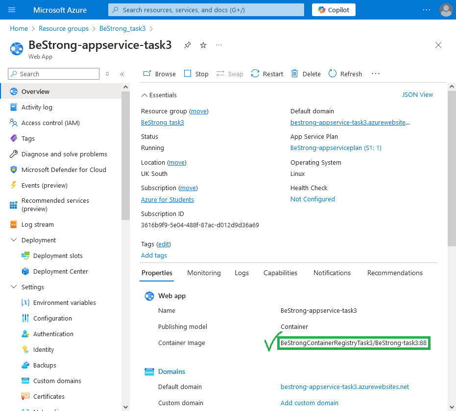
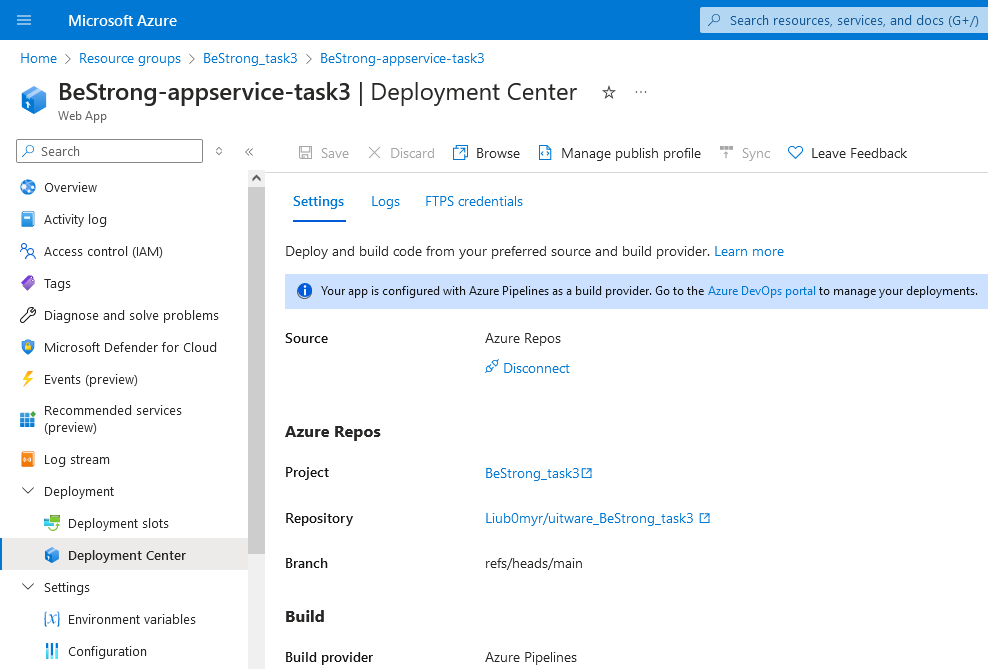

# [BeStrong task 3](https://github.com/Liub0myr/uitware_BeStrong_task3/)

Terraform was used to create:
* Resource group
  * Container registry
  * Web App
    * Linux plan



This pipeline is automatically started when PR is opened

```yml
trigger: none

pr:
  branches:
    include:
      - main

resources:
- repo: self

variables:
  tag: '$(Build.BuildId)'

stages:
- stage: Build
  displayName: Build image
  jobs:
  - job: Build
    displayName: Build
    pool:
      vmImage: ubuntu-latest
    steps:
    - task: Docker@2
      displayName: Build an image
      inputs:
        command: build
        dockerfile: '$(Build.SourcesDirectory)/Dockerfile'
        tags: |
          $(tag)
```

When changes are made to main, the following pipeline is triggered

```yml
trigger:
- main

pr: none

pool:
  vmImage: ubuntu-latest

variables:
  - group: terraform_vars
  - name: dockerfilePath
    value: '$(Build.SourcesDirectory)/Dockerfile'
  - name: vmImageName
    value: 'ubuntu-latest'
  - name: imageTag
    value: '$(Build.BuildId)'

jobs:
- job: infrastructure
  displayName: 'Creation of infrastructure'
  steps:
    - task: TerraformInstaller@1
      inputs:
        terraformVersion: 'latest'
      displayName: 'Terraform Install'
    - task: TerraformTaskV4@4
      inputs:
        workingDirectory: '$(System.DefaultWorkingDirectory)/terraform'
        provider: 'azurerm'
        command: 'init'
        backendServiceArm: $(backendServiceArm)
        backendAzureRmResourceGroupName: $(backendAzureRmResourceGroupName)
        backendAzureRmStorageAccountName: $(backendAzureRmStorageAccountName)
        backendAzureRmContainerName: $(backendAzureRmContainerName)
        backendAzureRmKey: '$(backendAzureRmKey).tfstate'
      displayName: 'Terraform Init'
    - task: TerraformTaskV4@4
      displayName: 'Validate'
      inputs:
        provider: 'azurerm'
        command: 'validate'
    - task: TerraformTaskV4@4
      displayName: 'Terraform Apply'
      inputs:
        provider: 'azurerm'
        command: 'apply'
        environmentServiceNameAzureRM: $(environmentServiceNameAzureRM)
        commandOptions: '-input=false -auto-approve'
        workingDirectory: '$(System.DefaultWorkingDirectory)/terraform'
      env:
          TF_VAR_container_registry_name: '$(containerRegistry)'
          TF_VAR_web_app_name: $(webAppName)
          TF_VAR_res_group_name: $(az_res_group_name)
          TF_VAR_res_group_location: $(az_res_group_location)

- job: buildAndPush
  dependsOn: infrastructure
  displayName: 'Build and push Docker image to container registry'
  pool:
    vmImage: $(vmImageName)
  steps:
  - task: Docker@2
    displayName: Build and push an image to container registry
    inputs:
      command: buildAndPush
      repository: $(imageRepository)
      dockerfile: $(dockerfilePath)
      containerRegistry: $(dockerRegistryServiceConnection)
      tags: |
        $(imageTag)
    env:
      ASPNETCORE_ENVIRONMENT: 'Development'
      ASPNETCORE_URLS: 'http://*:80'

- deployment: deployToWebApp
  displayName: 'Deploy Docker image to Azure Web App'
  dependsOn: buildAndPush
  environment: prod
  strategy:
    runOnce:
      deploy:
        steps:
        - task: AzureWebAppContainer@1
          inputs:
            azureSubscription: '$(environmentServiceNameAzureRM)'
            appName: '$(webAppName)'
            imageName: '$(containerRegistry)/$(imageRepository):$(imageTag)'
```
Important notes:
* Terraform doesn't track changes made by `deployToWebApp` job, so it's better not to do this :)
* a service connection must be created for the `deployToWebApp` job



The work of PR pipeline



After the merger, the deployment began







